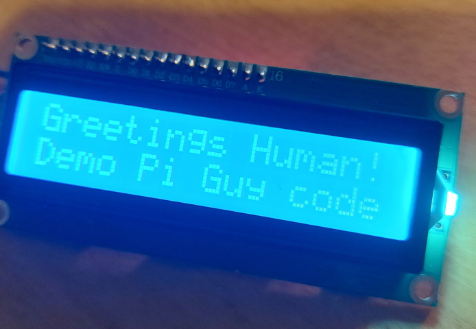

# I2C 16x2 LCD

# LCD
This repository contains all the code for interfacing with a **16x2 character I2C liquid-crystal display (LCD)**. This accompanies my **Youtube tutorial**: [Raspberry Pi - Mini LCD Display Tutorial](https://www.youtube.com/watch?v=fR5XhHYzUK0). 

You can buy one of these great little I2C LCD on eBay or somewhere like [the Pi Hut](https://thepihut.com/search?type=product&q=lcd).

# Installation
* Install git
  ``` 
  sudo apt install git
  ```

* Clone the repo in your `pi` home directory
  ``` 
  cd /home/pi/
  git clone https://github.com/the-raspberry-pi-guy/lcd.git
  cd lcd/
  ```

* Run the automatic installation script with `sudo` permission
  ``` 
  sudo ./install.sh
  ```

* After rebooting, try one of the [**demos**](<a href="https://github.com/SanjeevStephan/raspberry-pi/blob/main/105-The-GPIO/I2C-16x2-Lcd/show_myclock.py">show_myclock.py</a>)
  ``` 
  cd /home/pi/lcd/
  ./show_myclock.py
  ```

# Demos
## Simple strings
This is a demo developed by user @Tomtom0201, showing how simple text stings could be displayed on LCD:

<p align="center">
  
</p>

After editing the hosts and services dictionaries, you can run this demo in the background (as a service) as follows:
1. Create a new service file in `/lib/systemd/system/` called `rpi-netmonitor.service`:
```commandline
nano /lib/systemd/system/rpi-netmonitor.service
```
2. Copy and paste the following in the new service file:
```
[Unit]
Description=A RPi network monitor for a 16x2 LCD

[Service]
Type=simple
User=pi

ExecStart=/usr/bin/python /home/pi/rpi-lcd/demo_netmonit.py

Restart=always
RestartSec=5

KillMode=process
KillSignal=SIGINT

[Install]
WantedBy=multi-user.target
```
3. Enable the service and start it:
```commandline
sudo systemctl enable rpi-netmonitor.service
sudo systemctl start rpi-netmonitor.service
```
4. Check that the LCD is displaying the correct information; otherwise, check the service status
```commandline
sudo systemctl status rpi-netmonitor.service
```
